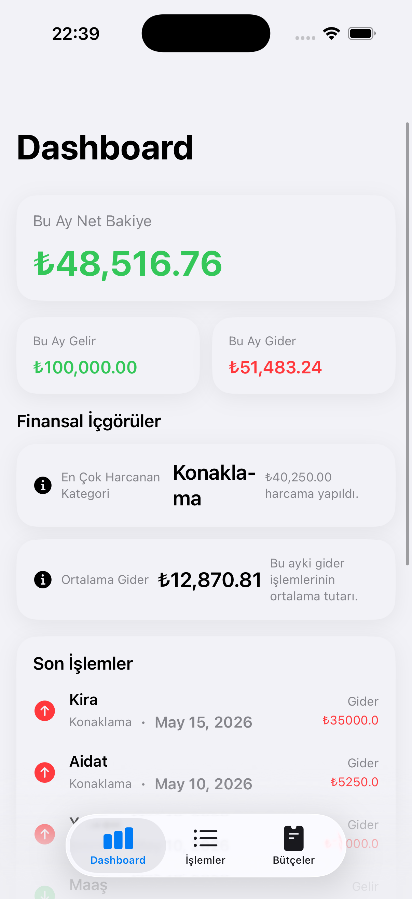
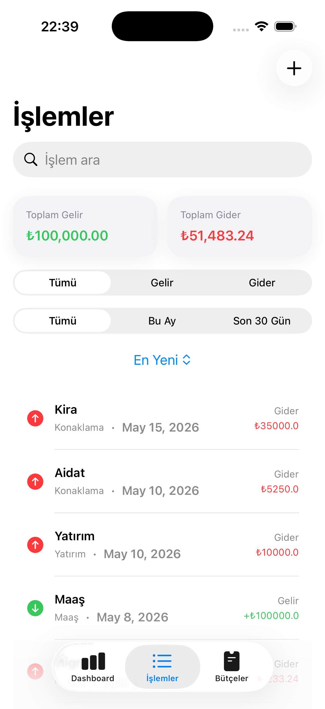
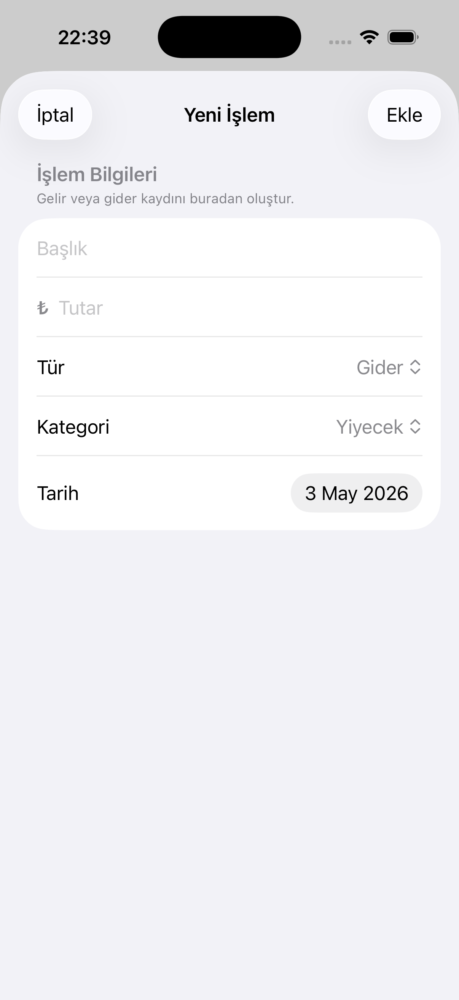
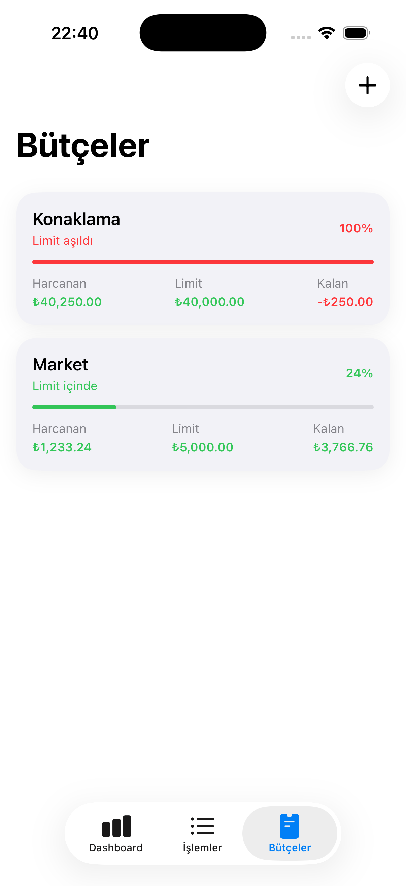

# 💸 FinanceFlow

Modern bir **iOS kişisel finans yönetimi uygulaması**.
SwiftUI ve SwiftData kullanılarak geliştirilmiştir.

---

## 🚀 Özellikler

### 📊 Dashboard
- Aylık gelir/gider özeti
- Net bakiye
- Kategori bazlı harcama analizi
- Finansal içgörüler (insights)
- Geçen ay karşılaştırmaları

### 💳 İşlem Yönetimi
- Gelir & gider ekleme
- Düzenleme & silme
- Kategori bazlı sınıflandırma
- Arama & filtreleme
- Tarih aralığı filtresi
- Sıralama seçenekleri

### 📅 Bütçe Yönetimi
- Kategori bazlı aylık bütçe
- Harcama takibi
- Limit aşım uyarıları

### 🎯 UX & UI
- Modern SwiftUI arayüzü
- Animasyonlar ve geçişler
- Inline form validasyonları
- Haptic feedback

---

## 🏗️ Teknik Detaylar

- SwiftUI
- SwiftData
- MVVM Architecture
- Unit Testing (Swift Testing)
- Custom Design System
- Advanced Filtering & Sorting
- Reusable Components

---

## 📱 Ekran Görüntüleri

| Dashboard | Transactions |
|----------|-------------|
|  |  |

| Add Transaction | Budget |
|----------------|--------|
|  |  |

---

## 🧪 Testler

- Dashboard hesaplamaları test edildi
- Filtreleme ve sıralama mantığı test edildi
- Validation senaryoları test edildi

---

## 📌 Geliştirilen Konular

Bu proje kapsamında:

- MVVM mimarisi uygulandı
- Business logic ViewModel katmanına taşındı
- SwiftData ile local persistence sağlandı
- UI/UX best practice’leri uygulandı

---

## 🔮 Gelecek Geliştirmeler

- iCloud senkronizasyon
- AI destekli harcama analizi
- Export / import
- Dark mode iyileştirmeleri

---

## 👤 Geliştirici

Orhan Özdemir
iOS Developer
